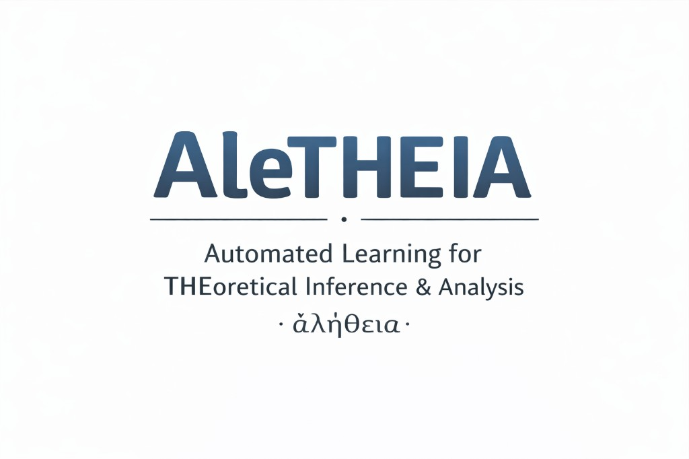
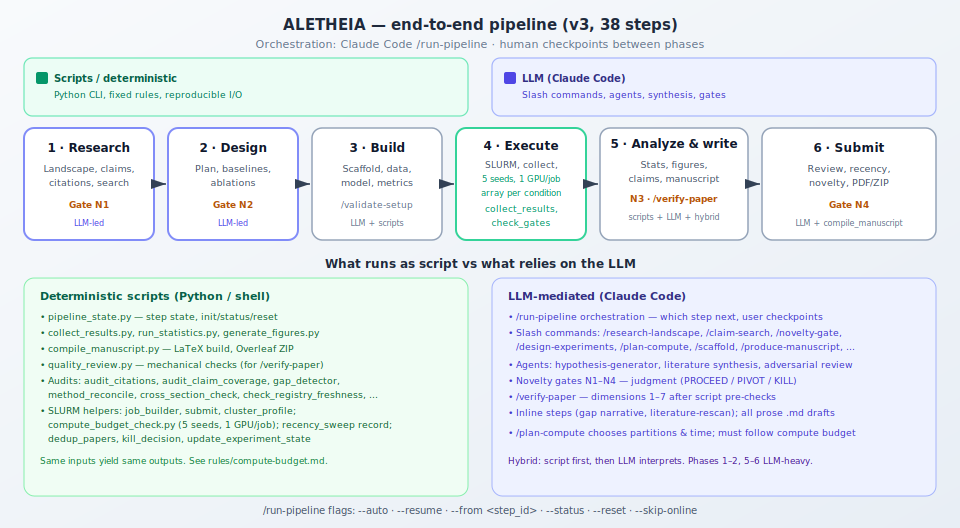

<div align="center">



<p>
  <a href="https://github.com/EmaRimoldi/Claude-scholar-extended/stargazers"></a>
  <a href="https://github.com/EmaRimoldi/Claude-scholar-extended/network/members"></a>
  
  
  
</p>

**ALETHEIA** — *Automated Learning for THEoretical Inference & Analysis* · **ἀλήθεια** (truth, disclosure)

[Workflow diagram](#research-workflow-v3) · [Run the pipeline in Claude](#run-the-full-pipeline-in-claude-code) · [Quick start](#quick-start) · [Documentation](#documentation)

</div>

---

ALETHEIA is a **semi-automated research assistant** for computer science and AI researchers: literature and novelty assessment, experiment design, implementation, cluster execution, statistical analysis, manuscript preparation, and submission checks. **Human judgment stays central**; [Claude Code](https://github.com/anthropics/claude-code) runs skills, slash commands, hooks, and the **v3 pipeline** (38 steps, six phases, four novelty gates).

This repository extends and maintains the workflow originally shaped by the **[Claude Scholar](https://github.com/Galaxy-Dawn/claude-scholar)** ecosystem (skills, commands, agents, Obsidian/Zotero integration). ALETHEIA is the project name for this line of work; the repo remains a **Claude Code plugin / configuration bundle** you install into `~/.claude` or use from a cloned tree.

---

## Research workflow (v3)

The pipeline is **opinionated and checkpointed**: each phase can stop for your decision before continuing.



| Phase | Focus | Gates / checkpoints |
|------|--------|----------------------|
| **1** | Research & novelty — landscape, claims, citations, adversarial search | **N1** |
| **2** | Experiment design — baselines, ablations, power | **N2** |
| **3** | Implementation — scaffold, data, model, metrics, validation | — |
| **4** | Execution — data download, compute plan, runs, collection | — |
| **5** | Analysis & writing — results, claims, story, manuscript, **/verify-paper** | **N3** |
| **6** | Pre-submission — reviews, recency, **N4**, compile PDF / Overleaf ZIP | **N4** |

Details: [`commands/run-pipeline.md`](commands/run-pipeline.md), [`pipeline-v3-spec.md`](pipeline-v3-spec.md). State machine: [`scripts/pipeline_state.py`](scripts/pipeline_state.py).

---

## Run the full pipeline in Claude Code

The intended way to execute the end-to-end flow is the **`/run-pipeline`** slash command inside a **Claude Code** session. It reads and updates **`pipeline-state.json`** and directs work under your **`PROJECT_DIR`** (typically `projects/<topic-slug>/`), not the plugin repo root.

### 1. Install ALETHEIA into Claude Code

From a clone of this repository:

```bash
git clone https://github.com/EmaRimoldi/Claude-scholar-extended.git
cd Claude-scholar-extended
bash scripts/setup.sh
```

`setup.sh` merges skills, commands, agents, rules, hooks, and scripts into `~/.claude/` (with backups). See [Quick start](#quick-start) for minimal or selective installs.

### 2. Open a project and initialize pipeline state

In Claude Code, either work inside the cloned repo or open your research repository that already uses these commands.

1. Create a dedicated project directory and state (if you do not already have one):

   ```
   /new-project "Your research topic"
   ```

   This sets up `projects/<slug>/` and ties **`pipeline-state.json`** to that folder.

2. Or initialize state manually:

   ```bash
   python scripts/pipeline_state.py init --project your-topic-slug
   ```

### 3. Run the orchestrator

In the Claude Code chat, run:

| Command | Effect |
|---------|--------|
| `/run-pipeline` | Interactive mode: next pending step, confirm between steps |
| `/run-pipeline --auto` | Run steps without asking for confirmation |
| `/run-pipeline --resume` | Continue from last incomplete step in `pipeline-state.json` |
| `/run-pipeline --from scaffold` | Start at a given **step id** (e.g. `scaffold`, `analyze-results`) |
| `/run-pipeline --status` | Print progress and exit |
| `/run-pipeline --reset` | Reset all steps to pending |
| `/run-pipeline --skip-online` | Skip steps that need network access |

The command implementation is [`commands/run-pipeline.md`](commands/run-pipeline.md): Claude follows that spec to invoke each slash command in order (e.g. `/research-landscape`, `/design-experiments`, … `/compile-manuscript`).

### 4. Check state from the terminal

```bash
python3 scripts/pipeline_state.py status
python3 scripts/pipeline_state.py steps | head
```

### 5. Read next

- **[docs/QUICKSTART.md](docs/QUICKSTART.md)** — prerequisites, credentials, Obsidian bootstrap, phase overview  
- **[docs/CLAUDE_REFERENCE.md](docs/CLAUDE_REFERENCE.md)** — full skill and command index  
- **[CLAUDE.md](CLAUDE.md)** — workspace defaults and lifecycle summary  

---

## Quick start

### Requirements

- [Claude Code](https://github.com/anthropics/claude-code) (primary)
- Git  
- Optional: Python 3.10+ and [uv](https://docs.astral.sh/uv/) for `scripts/` helpers  
- Optional: [Zotero](https://www.zotero.org/) + [zotero-mcp](https://github.com/Galaxy-Dawn/zotero-mcp) for literature workflows  
- Optional: [Obsidian](https://obsidian.md/) for the project knowledge base  

### Full install (recommended)

```bash
git clone https://github.com/EmaRimoldi/Claude-scholar-extended.git
cd Claude-scholar-extended
bash scripts/setup.sh
```

On Windows, use Git Bash or WSL. To update later: `git pull --ff-only` and run `bash scripts/setup.sh` again.

### Minimal install

Copy only the hooks, skills, or commands you need into `~/.claude/`; see the [original quick-start patterns](https://github.com/Galaxy-Dawn/claude-scholar) (subset of `skills/`, `hooks/`). You must merge MCP and hook entries from `settings.json.template` yourself.

### Environment for Python scripts

See [ENVIRONMENT_SETUP.md](ENVIRONMENT_SETUP.md).

---

## Core capabilities

| Area | What ALETHEIA supports |
|------|-------------------------|
| Literature & novelty | Multi-pass search, citation ledger, novelty gates, competitive checks |
| Experiments | Design, scaffolded code (Hydra, Registry patterns), SLURM helpers, result collection |
| Analysis | Strict statistics, figures, gap detection, claim–evidence mapping |
| Writing | Manuscript production, `/verify-paper`, LaTeX compile, rebuttal workflow |
| Knowledge | Obsidian project memory, Zotero bridge, daily / experiment logs |

---

## Integrations

- **Zotero** — import, collections, full text via MCP: [MCP_SETUP.md](MCP_SETUP.md)  
- **Obsidian** — filesystem-first project vault: [OBSIDIAN_SETUP.md](OBSIDIAN_SETUP.md)  

---

## Documentation

| File | Contents |
|------|----------|
| [CLAUDE.md](CLAUDE.md) | Workspace configuration and v3 lifecycle summary |
| [docs/CLAUDE_REFERENCE.md](docs/CLAUDE_REFERENCE.md) | Skills, commands, agents |
| [docs/QUICKSTART.md](docs/QUICKSTART.md) | Researcher onboarding |
| [docs/PROJECT_LAYOUT.md](docs/PROJECT_LAYOUT.md) | Where paper/project outputs live (`projects/<slug>/`) |
| [settings.json.template](settings.json.template) | Hooks, plugins, MCP template |

---

## Contributing

Issues and pull requests are welcome. For installer or workflow changes, describe the scenario, current limitation, and expected behavior.

---

## License

MIT License.

---

## Citation

If ALETHEIA helps your work, you can cite this repository as:

```bibtex
@misc{aletheia_2026,
  title        = {{ALETHEIA}: Semi-automated research assistant (Claude Code workflow)},
  author       = {Rimoldi, Ema},
  year         = {2026},
  howpublished = {\url{https://github.com/EmaRimoldi/Claude-scholar-extended}},
  note         = {Extends the Claude Scholar plugin ecosystem}
}
```

---

## Acknowledgments

- Built for **[Claude Code](https://github.com/anthropics/claude-code)**.  
- Workflow lineage and community roots: **[Claude Scholar](https://github.com/Galaxy-Dawn/claude-scholar)** (Gaorui Zhang et al.).  
- Inspiration: [everything-claude-code](https://github.com/anthropics/everything-claude-code), [AI-research-SKILLs](https://github.com/zechenzhangAGI/AI-research-SKILLs).

---

**Repository:** [https://github.com/EmaRimoldi/Claude-scholar-extended](https://github.com/EmaRimoldi/Claude-scholar-extended)
