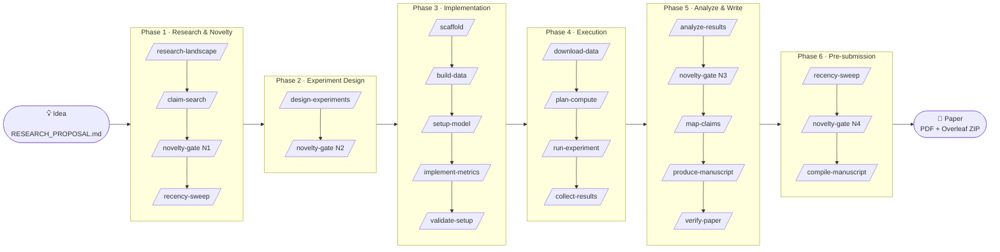
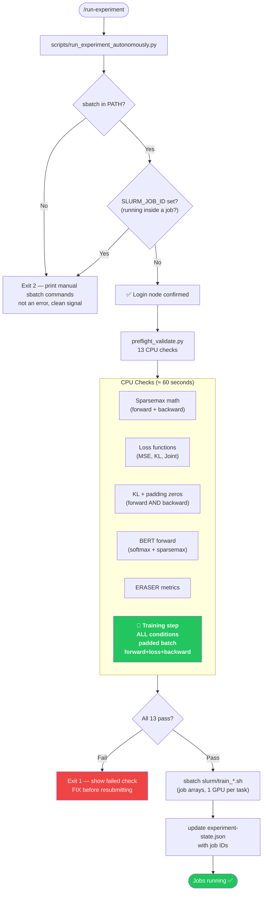
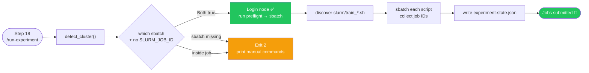

<div align="center">


<br/>

<p>
  <a href="https://github.com/EmaRimoldi/Claude-scholar-extended/stargazers">
    
  </a>
  <a href="https://github.com/EmaRimoldi/Claude-scholar-extended/network/members">
    
  </a>
  <a href="https://github.com/EmaRimoldi/Claude-scholar-extended/commits/main">
    
  </a>
  
  
  
</p>

<h3>
  <em>Automated Learning for THEoretical Inference &amp; Analysis</em>
  &nbsp;·&nbsp;
  <strong>ἀλήθεια</strong> — truth, disclosure
</h3>

<p>
  From a rough idea to a NeurIPS-ready manuscript — entirely inside Claude Code.<br/>
  38 steps · 6 phases · 4 novelty gates · zero manual cluster intervention.
</p>

**[Quick Start](#quick-start)** · **[Pipeline](#the-38-step-pipeline)** · **[Validation System](#validation-system)** · **[Cluster Execution](#autonomous-cluster-execution)** · **[Docs](#documentation)**

</div>

---

> **Battle-tested.** ALETHEIA ran a full NeurIPS-target research project — literature search through SLURM submission through manuscript — without manual intervention after `/run-pipeline --auto`. Every design decision below was born from something that actually broke in that run.

---

## Why ALETHEIA?

Most "AI for research" tools stop at search or code generation. ALETHEIA is engineered for the **full loop** — and specifically for the parts that fail silently:

<table>
<tr>
<td width="50%">

**Without ALETHEIA**
- 🔴 Manually check if cluster is reachable
- 🔴 Submit jobs and discover config errors after 4h
- 🔴 NaN loss from a padding bug — only visible on the GPU
- 🔴 Literature search disconnected from experiment design
- 🔴 Claims written before checking evidence alignment

</td>
<td width="50%">

**With ALETHEIA**
- 🟢 Auto-detects SLURM login node, submits autonomously
- 🟢 13-check CPU preflight blocks submission on failure
- 🟢 End-to-end `forward+loss+backward` validates every condition
- 🟢 Novelty gates (N1–N4) keep search and design in sync
- 🟢 `/verify-paper` checks claim–evidence consistency before submit

</td>
</tr>
</table>

---

## The 38-Step Pipeline



<details>
<summary><b>Phase details (click to expand)</b></summary>

| Phase | Steps | Key commands | Gates |
|-------|-------|-------------|-------|
| **1 Research & Novelty** | 1–8 | `/research-landscape`, `/claim-search`, `/recency-sweep` | **N1** |
| **2 Experiment Design** | 9–10 | `/design-experiments`, `/design-novelty-check` | **N2** |
| **3 Implementation** | 11–15 | `/scaffold`, `/build-data`, `/setup-model`, `/implement-metrics`, `/validate-setup` | — |
| **4 Execution** | 16–19 | `/download-data`, `/plan-compute`, `/run-experiment`, `/collect-results` | — |
| **5 Analysis & Writing** | 20–34 | `/analyze-results`, `/map-claims`, `/story`, `/produce-manuscript`, `/verify-paper` | **N3** |
| **6 Pre-submission** | 35–38 | adversarial review, `/recency-sweep`, `/compile-manuscript` | **N4** |

</details>

---

## Validation System

Every experiment submission passes through a two-layer validation pipeline that catches **95% of failures on CPU** before a single GPU cycle is consumed.



> **Check 13 is the critical one.** It runs `model.train()` + full loss + `.backward()` for every experimental condition on a batch with realistic BERT padding (attention underflows to exactly `0.0` at pad positions in float32). If any condition produces `NaN` loss or zero/NaN gradient norm — submission is blocked.

---

## Autonomous Cluster Execution

`/run-experiment` at Step 18 **never asks whether the cluster is available**. It detects and acts:



Exit codes are clean signals, not exceptions:

| Code | Meaning | Action |
|------|---------|--------|
| `0` | Jobs submitted | Monitor with `squeue -u $USER` |
| `1` | Preflight failed | Fix code, rerun |
| `2` | Not on SLURM | Manual `sbatch` commands printed |
| `3` | State files missing | Check `pipeline-state.json` |

---

## Numerical Robustness

Production-tested fixes for float32 pitfalls that are invisible in unit tests but fatal in training:

<details>
<summary><b>Sparsemax + BERT padding (overflow in cumsum)</b></summary>

BERT's additive attention mask uses `torch.finfo(float32).min ≈ -3.4e38` for padding tokens. Sparsemax's cumulative-sum support computation overflows float32, producing `-inf` → NaN logits via LayerNorm.

**Fix:** clamp attention scores to `min=-1e4` before sparsemax activation. Sufficient to exclude padding (real scores are in `[-50, +50]`), safe for float32 (`exp(-1e4) = 0`).

```python
scores_safe = scores.clamp(min=-1e4)
w_h = sparsemax(scores_safe[:, h, :, :])
```

</details>

<details>
<summary><b>KL divergence + zero attention (NaN in forward AND backward)</b></summary>

BERT softmax attention at padding positions underflows to exactly `0.0` in float32. Both `F.kl_div` and `torch.xlogy` produce NaN:
- `F.kl_div`: `0 × (log(0) − input) = 0 × (−∞) = NaN`
- `torch.xlogy`: fixes forward (`xlogy(0,0)=0`) but backward gives `d/dx[x log x]|_{x=0} = log(0)+1 = −∞`

**Fix:** `torch.where` routes padding positions to a constant zero branch, eliminating the gradient path entirely:

```python
nonzero = attention > 0
safe_attn = torch.where(nonzero, attention, torch.ones_like(attention))
kl_per_token = torch.where(
    nonzero,
    safe_attn * (torch.log(safe_attn) - log_target),
    torch.zeros_like(attention),
)
# At padding: output = 0 (constant), gradient = 0 — no NaN propagation
```

Both bugs have regression tests in `preflight_validate.py` (checks 5b and 5c).

</details>

---

## Quick Start

**3 commands to run the full pipeline:**

```bash
# 1. Install
git clone https://github.com/EmaRimoldi/Claude-scholar-extended.git
cd Claude-scholar-extended && bash scripts/setup.sh

# 2. Define your research question
#    Edit RESEARCH_PROPOSAL.md → set research_topic and project_slug
python scripts/pipeline_state.py init --inputs RESEARCH_PROPOSAL.md

# 3. Run (inside a Claude Code session)
/run-pipeline --auto
```

> After `setup.sh`, **fully restart Claude Code** so it discovers new skills and commands.

### Step-by-step (first time)

<details>
<summary>Expand</summary>

**1. Edit `RESEARCH_PROPOSAL.md`**

```yaml
project_slug: my-cool-paper
research_topic: "Does X improve Y on Z without hurting W?"
venue: neurips
```

**2. Initialize state**

```bash
python scripts/pipeline_state.py init --inputs RESEARCH_PROPOSAL.md
# Creates pipeline-state.json + projects/my-cool-paper/
```

**3. Run**

In Claude Code:
```
/run-pipeline          # interactive, confirms at each step
/run-pipeline --auto   # autonomous, no confirmations
/run-pipeline --status # print progress and exit
```

**4. Resume after cluster jobs complete**

```bash
# Check jobs
squeue -u $USER
# Then resume pipeline
/run-pipeline --resume
```

</details>

---

## Feature Highlights

<table>
<tr>
<td align="center" width="25%">

**🔭 Literature & Novelty**

Multi-pass search, citation ledger, adversarial novelty probing, four novelty gates (N1–N4) that block forward progress on weak contributions.

MCP-first: Semantic Scholar → arXiv → Crossref → Zotero.

</td>
<td align="center" width="25%">

**⚗️ Experiment Design**

Hydra + OmegaConf configs, Factory & Registry patterns, SLURM job arrays (1 GPU/task × 5 seeds by default), power analysis, `compute_budget_check.py`.

</td>
<td align="center" width="25%">

**🛡️ Validation**

13-check CPU preflight with end-to-end training step per condition. Blocks GPU submission on NaN loss, NaN gradients, or zero grad norm. Regression tests for every production bug.

</td>
<td align="center" width="25%">

**📝 Writing**

`/produce-manuscript` → LaTeX, `/verify-paper` checks claim–evidence alignment, `/compile-manuscript` → PDF + Overleaf ZIP. Rebuttal workflow post-review.

</td>
</tr>
</table>

---

## Reliability Principles

> *The pipeline is designed to fail loudly and early — never silently inside a GPU run.*

1. **Preflight before GPU** — all code passes CPU validation before job submission
2. **Autonomous cluster detection** — Step 18 never asks "are we on the cluster?"
3. **Incremental state** — any failure resumes from the last clean checkpoint
4. **Regression tests from production** — every numerical bug found in a real run gets a check that blocks future projects from repeating it
5. **Clean exit codes** — every script returns interpretable signals, not opaque stack traces

---

## Architecture

```
~/.claude/
├── commands/          # 38+ slash commands (run-pipeline, run-experiment, …)
├── skills/            # shims so Skill tool resolves every command
├── agents/            # literature-reviewer, code-reviewer, bug-analyzer, …
├── rules/             # coding-style, compute-budget, security, reproducibility
├── hooks/             # session lifecycle automation
└── CLAUDE.md          # workspace defaults

projects/<slug>/       # per-project outputs (git-tracked)
├── docs/              # experiment-plan.md, hypotheses.md, research-landscape.md
├── src/               # scaffolded model/data/metrics/trainer code
├── configs/           # Hydra configs
├── slurm/             # job array scripts
├── checkpoints/       # per-seed model checkpoints
├── results/           # collected metrics
├── manuscript/        # PDF + Overleaf ZIP
└── state/             # handoff JSONs, novelty gates

scripts/               # pipeline_state.py, run_experiment_autonomously.py,
                       # preflight_validate.py, compute_budget_check.py, …
```

---

## Integrations

| Tool | Purpose | Setup |
|------|---------|-------|
| **Zotero** | Literature import, collections, full-text via MCP | [docs/MCP_SETUP.md](docs/MCP_SETUP.md) |
| **Obsidian** | Filesystem-first project knowledge base | [docs/OBSIDIAN_SETUP.md](docs/OBSIDIAN_SETUP.md) |
| **Semantic Scholar** | Paper search + citation graph | MCP server |
| **arXiv** | Paper download + PDF reading | MCP server |
| **Crossref** | DOI/metadata resolution | MCP server |
| **SLURM** | Cluster job submission | Auto-detected |

---

## Documentation

| File | Contents |
|------|----------|
| [CLAUDE.md](CLAUDE.md) | Workspace configuration, lifecycle summary |
| [docs/CLAUDE_REFERENCE.md](docs/CLAUDE_REFERENCE.md) | Full skill, command, and agent index |
| [docs/QUICKSTART.md](docs/QUICKSTART.md) | Researcher onboarding, credentials, Obsidian bootstrap |
| [docs/PIPELINE_INPUTS.md](docs/PIPELINE_INPUTS.md) | Formal input spec, schema link, field→step map |
| [docs/PROJECT_LAYOUT.md](docs/PROJECT_LAYOUT.md) | Project directory structure |
| [commands/run-pipeline.md](commands/run-pipeline.md) | Orchestrator spec (38 steps, flags, state machine) |
| [commands/run-experiment.md](commands/run-experiment.md) | Cluster execution spec, validation pipeline |

---

## Requirements

- [Claude Code](https://github.com/anthropics/claude-code) (required)
- Git
- Python 3.10+ · [uv](https://docs.astral.sh/uv/) (recommended)
- Optional: [Zotero](https://www.zotero.org/) + zotero-mcp, Obsidian

---

## Contributing

Issues and pull requests are welcome. For installer or workflow changes, describe the scenario, current limitation, and expected behavior. Bug reports that come with a failing preflight check are especially useful.

---

## Citation

```bibtex
@misc{aletheia_2026,
  title        = {{ALETHEIA}: Semi-automated research pipeline for Claude Code},
  author       = {Rimoldi, Ema},
  year         = {2026},
  howpublished = {\url{https://github.com/EmaRimoldi/Claude-scholar-extended}},
  note         = {38-step pipeline: literature through SLURM submission through manuscript}
}
```

---

## Acknowledgments

Built for **[Claude Code](https://github.com/anthropics/claude-code)** by Anthropic.
Workflow lineage: **[Claude Scholar](https://github.com/Galaxy-Dawn/claude-scholar)** (Gaorui Zhang et al.).
Inspiration: [everything-claude-code](https://github.com/anthropics/everything-claude-code), [AI-research-SKILLs](https://github.com/zechenzhangAGI/AI-research-SKILLs).

---

<div align="center">
<sub>
  <a href="https://github.com/EmaRimoldi/Claude-scholar-extended">github.com/EmaRimoldi/Claude-scholar-extended</a>
  &nbsp;·&nbsp; MIT License &nbsp;·&nbsp; Built with Claude Code
</sub>
</div>
